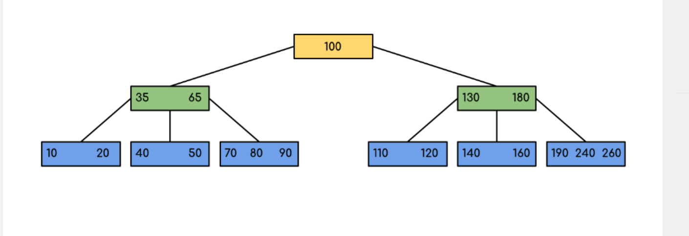

# LAB 2 - Documentation

### Contexte

Nous avons choisi de découper l'algorithme du B-Tree en deux classes différentes : 
- La classe BTree qui représente l'arbre. 
- La classe BTreeNode qui représente une cellule de l'arbre. Chaque cellule contient sa propre liste de cellules enfantes.

### Description de l'expérience. 

Nous avons construit, dans le Main de l'application, l'arbre suivant : 

On lance alors le programme, avec comme objectif, de trouver la cellule contenant la clef 160. On trouve donc la cellule du milieu du 3ème étage de la partie droite de l'arbre.
